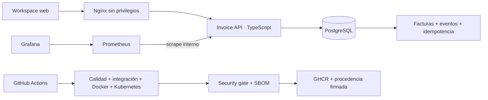

# InvoiceOps Platform

[](https://github.com/jorgefprietol/invoiceops-platform/actions/workflows/ci.yml)

Plataforma de facturación con un ciclo de entrega automatizado y operación observable. Integra **TypeScript, PostgreSQL, Docker, Kubernetes, GitHub Actions, Prometheus y Grafana** para gestionar facturas, conservar trazabilidad y verificar releases antes de publicar sus imágenes.

Proyecto de ingeniería independiente de **Jorge Prieto**. El repositorio contiene la implementación, las decisiones de arquitectura, pruebas reproducibles y procedimientos operativos. Las capacidades se presentan a partir de evidencia técnica; no se atribuyen despliegues comerciales ni resultados de clientes.

## Capacidades

- Facturas en USD: borrador → emitida → pagada, con anulación de borradores y facturas emitidas.
- Cálculo en centavos enteros y redondeo del impuesto sobre el subtotal, con límites explícitos de negocio.
- Idempotencia persistente: misma clave y solicitud devuelven el mismo resultado, incluso después de recrear la API.
- Concurrencia con versión esperada, bloqueo de fila y transacción única para factura, evento e idempotencia.
- Workspace web adaptable a móviles, autenticación por token y consulta del historial.
- Imágenes independientes para API y Nginx, usuario sin privilegios, filesystem de aplicación de solo lectura y bases fijadas por digest.
- Kubernetes con dos réplicas de API, probes, recursos, volumen persistente, PodDisruptionBudget y políticas de red declarativas.
- Métricas de errores, latencia, operaciones y reintentos; dashboard de seis paneles y reglas de alerta.
- CI con PostgreSQL real, aceptación de contenedores y Kubernetes, análisis de vulnerabilidades, SBOM y publicación en GHCR con attestations OIDC.

## Arquitectura



## Ejecución local

Requisitos: Docker con contenedores Linux, Docker Compose y Node.js 24 para los comandos de inicialización y verificación. El servicio de aplicación usa el runtime fijado en el Dockerfile. El stack completo tiene un presupuesto aproximado de 1 GB de RAM para sus límites de contenedor; Kubernetes necesita memoria adicional.

```powershell
git clone https://github.com/jorgefprietol/invoiceops-platform.git
cd invoiceops-platform
npm run init
docker compose --profile observability up --build -d --wait --wait-timeout 300
npm run smoke
```

| Componente | Dirección |
| --- | --- |
| Workspace | http://127.0.0.1:18100 |
| Grafana | http://127.0.0.1:13100/d/invoiceops-operations |
| Prometheus | http://127.0.0.1:19100 |

La inicialización genera credenciales aleatorias en `.env`, excluido del repositorio. Introduce `API_TOKEN` en el workspace. La clave se conserva solo en memoria de la página. Grafana usa `admin` y el valor de `GRAFANA_PASSWORD`. Los puertos publicados escuchan en loopback; PostgreSQL y la API no publican puertos del host.

Para ejecutar solo la aplicación: `docker compose up --build -d --wait`. El perfil `observability` agrega Prometheus y Grafana. Cambia los puertos en `.env` para ejecutar otra instalación.

## Verificación

```powershell
npm ci --ignore-scripts
npm run verify
npm run smoke
node scripts/verify-operations.mjs
node scripts/kubernetes.mjs
```

El último comando requiere `kind` y `kubectl` en PATH; crea únicamente el cluster `invoiceops` y guarda su kubeconfig en `.artifacts`. Prueba reinicio de API, estado persistente, rechazo de una imagen inválida, disponibilidad durante ese fallo y rollback. Cierra el port-forward al terminar y conserva el cluster para inspección. [Operación de Kubernetes](docs/kubernetes.md).

Las pruebas de integración se ejecutan contra una base separada indicada por `DATABASE_URL`; el workflow provisiona su propia instancia PostgreSQL. Incluyen ocho solicitudes concurrentes con una misma clave, conflictos de payload, carreras de actualización y rollback de una transición rechazada.

## Entrega

Pull requests y pushes a `develop` ejecutan calidad y aceptación sin publicar. Un push aprobado a `main` publica **las mismas dos imágenes que pasaron las pruebas**, sin reconstruirlas, con etiquetas `sha-<commit>`, SBOM SPDX y procedencia firmada mediante OIDC. Los manifiestos de release registran el digest inmutable de cada imagen.

La aceptación despliega en un cluster efímero del runner de GitHub; no implica un despliegue cloud permanente. El `Jenkinsfile` ofrece una ruta alternativa de construcción y aceptación para agentes Linux con Docker y Node.js 24. Su ejecución en un servidor Jenkins no forma parte de la evidencia de GitHub Actions.

## Documentación

[Contrato de API](docs/api.md) · [Decisiones de arquitectura](docs/architecture.md) · [Pipeline y GitFlow](docs/delivery.md) · [Operación y recuperación](docs/operations.md) · [Kubernetes](docs/kubernetes.md) · [Evidencia de verificación](docs/verification.md) · [Descripción profesional del proyecto](docs/experience.md).

## Alcance

El token compartido identifica una instalación de confianza. Para uso comercial se requiere identidad individual, roles, TLS, políticas de retención, administración de clientes y cumplimiento fiscal. Registrar un cobro representa una acción operativa; no procesa dinero ni se conecta a un proveedor de pagos. PostgreSQL tiene una sola instancia: las dos réplicas de API no hacen altamente disponible la base de datos. Las reglas de Prometheus se evalúan localmente; no hay un canal de notificación externo configurado.

Licencia [MIT](LICENSE).
