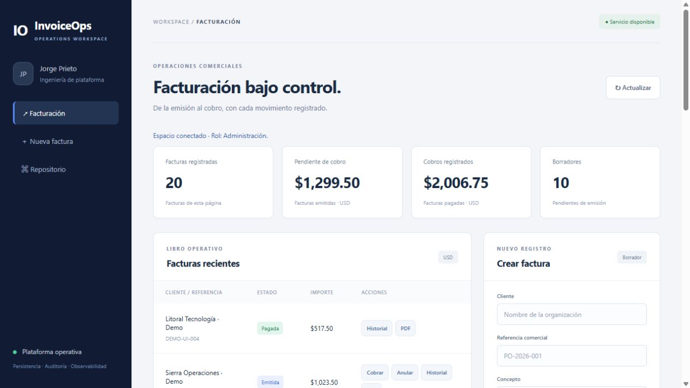
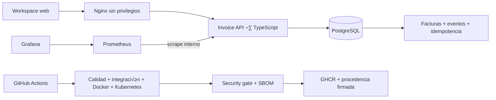

# InvoiceOps Platform

[](https://github.com/jorgefprietol/invoiceops-platform/actions/workflows/ci.yml)

Plataforma de facturación con un ciclo de entrega automatizado y operación observable. Integra **TypeScript, PostgreSQL, Docker, Kubernetes, GitHub Actions, Prometheus y Grafana** para gestionar facturas, conservar trazabilidad y verificar releases antes de publicar sus imágenes.

Proyecto de ingeniería independiente de **Jorge Prieto**. El repositorio contiene la implementación, las decisiones de arquitectura, pruebas reproducibles y procedimientos operativos. Las capacidades se presentan a partir de evidencia técnica; no se atribuyen despliegues comerciales ni resultados de clientes.



[Vista móvil](docs/images/mobile.png) · [Factura PDF de ejemplo](output/pdf/invoiceops-sample.pdf) · [Ejecución completa verificada](https://github.com/jorgefprietol/invoiceops-platform/actions/runs/37056053522).

## Capacidades

- Facturas en USD: borrador → emitida → pagada, con anulación de borradores y facturas emitidas.
- Cálculo en centavos enteros y redondeo del impuesto sobre el subtotal, con límites explícitos de negocio.
- Idempotencia persistente: misma clave y solicitud devuelven el mismo resultado, incluso después de recrear la API.
- Concurrencia con versión esperada, bloqueo de fila y transacción única para factura, evento e idempotencia.
- Workspace adaptable a móviles, roles separados de emisión/cobro, paginación por cursor y PDF con tipografía incrustada.
- Imágenes independientes para API y Nginx, usuario sin privilegios, filesystem de aplicación de solo lectura y bases fijadas por digest.
- Kubernetes con dos réplicas de API, probes, recursos, volumen persistente, PodDisruptionBudget y políticas de red declarativas.
- Métricas de errores, latencia, operaciones y reintentos; dashboard de seis paneles y reglas de alerta.
- CI con PostgreSQL real, aceptación de contenedores y Kubernetes, análisis de vulnerabilidades, SBOM y publicación en GHCR con attestations OIDC.

## Arquitectura



## Ejecución local

Requisitos: Docker con contenedores Linux, Docker Compose y Node.js 24 para los comandos de inicialización y verificación. El servicio de aplicación usa el runtime fijado en el Dockerfile. El stack completo tiene un presupuesto aproximado de 1 GB de RAM para sus límites de contenedor; Kubernetes necesita memoria adicional.

```powershell
git clone https://github.com/jorgefprietol/invoiceops-platform.git
cd invoiceops-platform
npm run init
docker compose --profile observability up --build -d --wait --wait-timeout 300
npm run smoke
```

| Componente | Dirección |
| --- | --- |
| Workspace | http://127.0.0.1:18100 |
| Grafana | http://127.0.0.1:13100/d/invoiceops-operations |
| Prometheus | http://127.0.0.1:19100 |

La inicialización genera credenciales aleatorias en `.env`, excluido del repositorio. Introduce `API_TOKEN` para administrar; `API_ISSUER_TOKEN` para crear/emitir/anular; `API_COLLECTOR_TOKEN` para registrar cobros. Todos los roles pueden consultar facturas y exportar PDF. La clave se conserva solo en memoria de la página. Grafana usa `admin` y `GRAFANA_PASSWORD`. Los puertos publicados escuchan en loopback; PostgreSQL y la API no publican puertos del host.

Para ejecutar solo la aplicación: `docker compose up --build -d --wait`. El perfil `observability` agrega Prometheus y Grafana. Para otra instalación simultánea cambia los puertos, `COMPOSE_PROJECT_NAME` y los rangos `APPLICATION_SUBNET`, `DATA_SUBNET`, `TELEMETRY_SUBNET`, `MONITORING_SUBNET`; los defaults son `10.250.130.0/24` a `10.250.133.0/24`.

## Verificación

```powershell
npm ci --ignore-scripts
npm run verify
npm run smoke
node scripts/verify-operations.mjs
node scripts/kubernetes.mjs
```

El último comando requiere `kind` y `kubectl` en PATH; crea únicamente el cluster `invoiceops` y guarda su kubeconfig en `.artifacts`. Prueba reinicio de API, estado persistente, rechazo de una imagen inválida, disponibilidad durante ese fallo y rollback. Cierra el port-forward al terminar y conserva el cluster para inspección. [Operación de Kubernetes](docs/kubernetes.md).

`npm run verify` ejecuta obligatoriamente dominio, PDF e integración y crea una instancia PostgreSQL temporal con Docker cuando no existe `DATABASE_URL`. La elimina al terminar. Para utilizar una base de pruebas existente, indica `DATABASE_URL`; el workflow y el Jenkinsfile provisionan sus propias instancias. Las pruebas incluyen ocho solicitudes concurrentes, conflictos de payload, carreras de actualización, rollback de transiciones rechazadas, separación de roles y paginación con inserciones concurrentes. Para revisar solo dominio y PDF usa `npm run test:unit`.

## Entrega

Pull requests y pushes a `develop` ejecutan calidad y aceptación sin publicar. Un push aprobado a `main` publica **las mismas dos imágenes que pasaron las pruebas**, sin reconstruirlas, con etiquetas `sha-<commit>`, SBOM SPDX y procedencia firmada mediante OIDC. Los manifiestos de release registran el digest inmutable de cada imagen.

La aceptación despliega en un cluster efímero del runner de GitHub; no implica un despliegue cloud permanente. El `Jenkinsfile` ofrece una ruta alternativa de construcción y aceptación para agentes Linux con Docker y Node.js 24. Su ejecución en un servidor Jenkins no forma parte de la evidencia de GitHub Actions.

## Documentación

[Contrato de API](docs/api.md) · [Decisiones de arquitectura](docs/architecture.md) · [Pipeline y GitFlow](docs/delivery.md) · [Operación y recuperación](docs/operations.md) · [Kubernetes](docs/kubernetes.md) · [Evidencia de verificación](docs/verification.md) · [Descripción profesional del proyecto](docs/experience.md).

## Alcance

Los tokens de rol identifican funciones en una instalación de confianza y no personas individuales. Para uso comercial se requiere identidad individual, TLS, políticas de retención, administración de clientes y cumplimiento fiscal. El PDF es un resumen operativo, no un comprobante fiscal. Registrar un cobro no procesa dinero ni se conecta a un proveedor de pagos. PostgreSQL tiene una sola instancia: las dos réplicas de API no hacen altamente disponible la base. Las reglas de Prometheus se evalúan localmente; no hay notificaciones externas configuradas.

Licencia [MIT](LICENSE).

La fuente Noto Sans se redistribuye bajo [SIL Open Font License](assets/fonts/LICENSE.txt).

### PolÌtica de actualizaciÛn

El builder, el runtime de producciÛn y los tipos de Node permanecen en la lÌnea 24 LTS. TypeScript 7 declara explÌcitamente los tipos de Node; los cambios se validan con PostgreSQL real, pruebas de contenedores, aceptaciÛn Kubernetes y el an·lisis de vulnerabilidades de ambas im·genes. Dependabot conserva las actualizaciones de parche y digest del builder, y las migraciones de versiÛn mayor requieren una revisiÛn deliberada.
